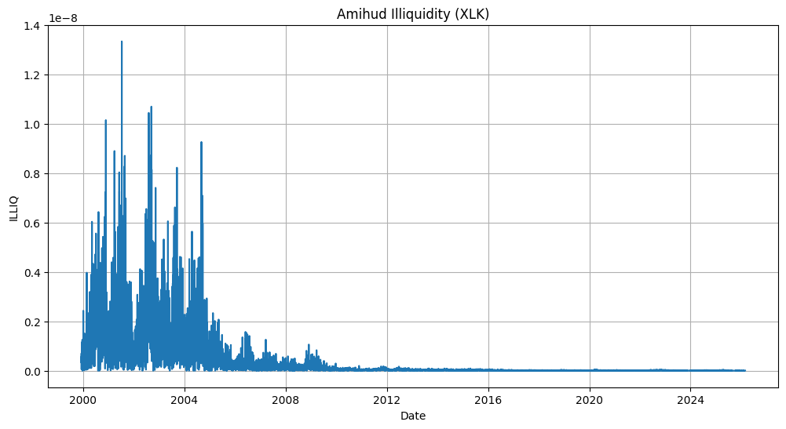
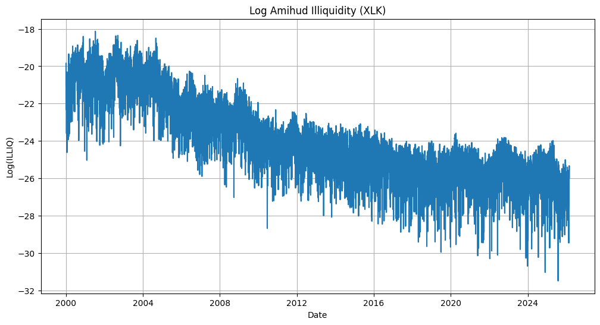
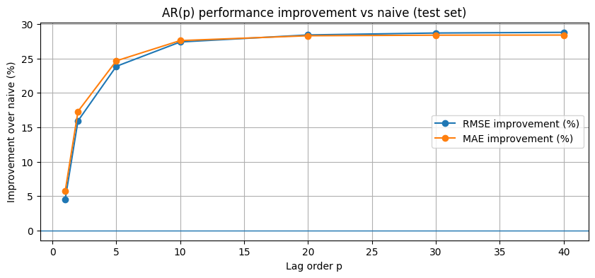
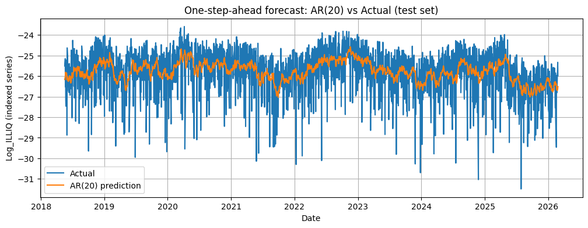
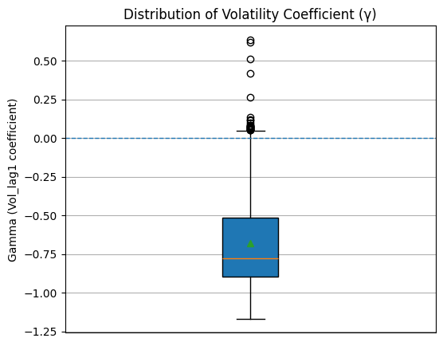
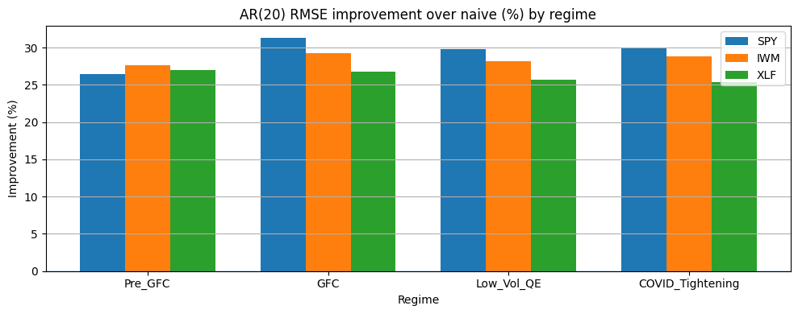
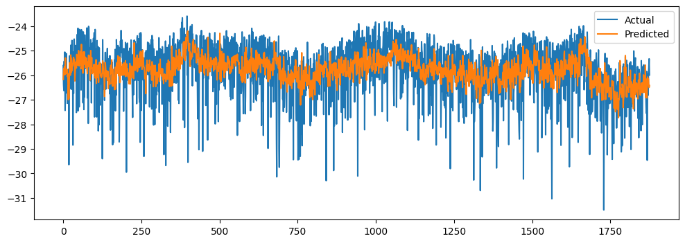

# time-series-liquidity-forecasting

## What is Market Liquidity?

Market liquidity describes how easily an asset can be bought or sold without significantly affecting its price.

In highly liquid markets, trades can be executed quickly, in large size, and with minimal price impact. In illiquid markets, even relatively small trades can move prices, spreads widen, and transaction costs increase. Liquidity therefore reflects the underlying health and stability of financial markets.

In modern financial systems, liquidity plays a central role. Institutional investors, asset managers, market makers, and algorithmic traders all rely on the ability to transact efficiently. When liquidity deteriorates — especially during periods of market stress — trading becomes more expensive, price volatility increases, and risk management becomes more difficult.

Unlike price returns, liquidity is not directly observable as a single number. It must be measured indirectly using trading data. In this project, liquidity is quantified using the Amihud illiquidity measure, which captures how strongly prices move relative to trading volume. Higher values indicate that prices react more aggressively to trades, meaning the market is less liquid.

Why Forecast Liquidity?

Forecasting liquidity is economically important for several reasons:

- Portfolio managers need liquidity estimates to manage transaction costs and execution risk.

- Risk managers monitor liquidity conditions because sudden dry-ups often coincide with market stress.

- Market makers adjust spreads and inventory based on expected trading conditions.

- If liquidity exhibits predictable structure this information can improve trading decisions, capital allocation, and risk assessment.

---

## Objectives:

- Quantify the predictability of next-day ETF liquidity

- Compare naive persistence, autoregressive models, and nonlinear machine learning methods to identify the most effective forecasting approach.

- Evaluate how volatility, rolling state variables, and regime indicators contribute to incremental predictive power.

- Test the stability of liquidity dynamics across major macro regimes (Pre-GFC, GFC, QE, COVID/Tightening).

- Validate whether liquidity persistence is asset-specific (XLK) or a general market phenomenon by analyzing multiple ETFs (SPY, IWM, XLF).

---

### Dataset:

The primary dataset consists of daily historical market data for XLK (Technology Select Sector ETF), which serves as the main asset for model development and evaluation.

Data is downloaded using yfinance and includes daily open, high, low, close prices and trading volume

The XLK sample spans approximately 2000–2024, covering multiple macroeconomic environments including the Global Financial Crisis, post-crisis QE period, and the COVID/tightening cycle.

For robustness and cross-asset validation, the analysis is later replicated on:

- SPY – S&P 500 ETF

- IWM – Russell 2000 ETF

- XLF – Financial Sector ETF

---

## Modeling Approach

#### Problem Framing

The objective is to forecast next-day ETF liquidity using a one-step-ahead time-series framework. Liquidity is measured using the Amihud illiquidity ratio:  

$ILLIQ_t = \frac{|Return_t|}{Dollar Volume}$

However, the raw Amihud measure is highly skewed and exhibits extreme spikes, particularly in earlier years (see plot above). To stabilize variance and reduce the influence of outliers, the forecasting target is defined as:

$Log_ILLIQ_t ​= log(ILLIQ_t)​$

The log transformation produces a more stable and approximately stationary series, making it better suited for regression-based forecasting models.

#### Evaluation Strategy

All models are evaluated using a walk-forward expanding-window framework:

- At each time step, the model is trained only on past data.

- A one-step-ahead forecast is generated.

- The training window expands as time progresses.

This setup mimics real-time forecasting and prevents look-ahead bias.

Performance is measured using:

- RMSE (Root Mean Squared Error)

- MAE (Mean Absolute Error)

- Benchmark (naive persistence)

#### Models Tested

Several forecasting approaches are compared:

- AR(20) — captures multi-day autoregressive structure.

- Ridge regression with lagged features — regularized linear model.

- Gradient Boosting (HistGradientBoostingRegressor) — nonlinear tree-based model.

- Feature-augmented specifications including volatility, rolling statistics, and regime indicators.

This progression allows comparison between:

- Pure persistence

- Linear structure

- Regularized linear models

- Nonlinear machine learning methods

---
## Key Results

1. Liquidity Exhibits Strong Multi-Day Persistence

The first figure shows AR(p) performance relative to a naive persistence benchmark. Even a small lag structure improves forecasts, but performance increases sharply as additional lags are included.

By p=10, the model already captures most of the available signal.
At p=20, AR improves RMSE by roughly 27–29% over naive persistence, with only marginal gains beyond that point.

This indicates that daily liquidity is not random noise.
It behaves as a slowly evolving state variable with memory extending multiple trading days.

2. Volatility Affects Liquidity — But Not Linearly

The second figure shows the distribution of the volatility coefficient from rolling Ridge regressions.

The coefficient is predominantly negative, confirming an economically intuitive relationship:

- Higher volatility yesterday is associated with higher illiquidity today.

However, earlier linear experiments showed that adding volatility lags barely improved forecasting accuracy. This suggests that while volatility and liquidity are structurally related, much of that information is already embedded in liquidity’s own persistence. The effect exists — but it is not a dominant incremental driver in a linear setting.

3. Persistence Survives Across Market Regimes

For XLK, the regime breakdown shows that the main result does not disappear in different environments. In every period — from pre-GFC to COVID — AR(20) improves over naive by roughly 26–31%. When we repeat the same exercise for SPY, IWM, and XLF, the magnitude of improvement looks very similar.

Across:

- Pre-GFC

- Global Financial Crisis

- Post-crisis QE

- COVID / tightening cycle

AR(20) consistently improves RMSE by ~25–31% relative to naive forecasts.

What we uncovered in XLK therefore seems to reflect a general feature of ETF liquidity rather than something asset-specific.

4. Nonlinear Models Provide Incremental Gains

To test whether liquidity dynamics contain nonlinear structure beyond linear autoregression, we implement a Gradient Boosting model with lagged liquidity, volatility, rolling statistics, and regime features.

Relative to AR(20), the nonlinear model improves RMSE by approximately 4–5%. The gain is modest but consistent, suggesting that some interactions — particularly those involving volatility under stress conditions — are not fully captured by linear dynamics.

At the same time, the magnitude of improvement indicates that nonlinear effects are secondary. Most predictive power still arises from liquidity’s multi-day persistence, with machine learning refining rather than redefining the signal.

---

## Takeaways

This project set out to forecast daily ETF liquidity using a disciplined time-series framework. Across models, regimes, and assets, one result stands out clearly: liquidity exhibits strong multi-day persistence.

An AR(20) model consistently improves upon a naive benchmark by roughly 25–30%, and this improvement remains stable across macroeconomic regimes and across different ETFs. The dominant source of predictability comes from liquidity’s own autoregressive structure.

Gradient Boosting further improves forecasting performance by approximately 4–5% relative to the linear AR benchmark. While the incremental gain is moderate, it indicates the presence of nonlinear interactions — particularly in how volatility relates to future liquidity under stress conditions. These nonlinear effects are real but secondary to the core persistence dynamic.

Overall, ETF liquidity behaves as a gradually evolving market state rather than as pure noise. Its short-horizon dynamics are structured, robust, and remarkably stable across environments.
